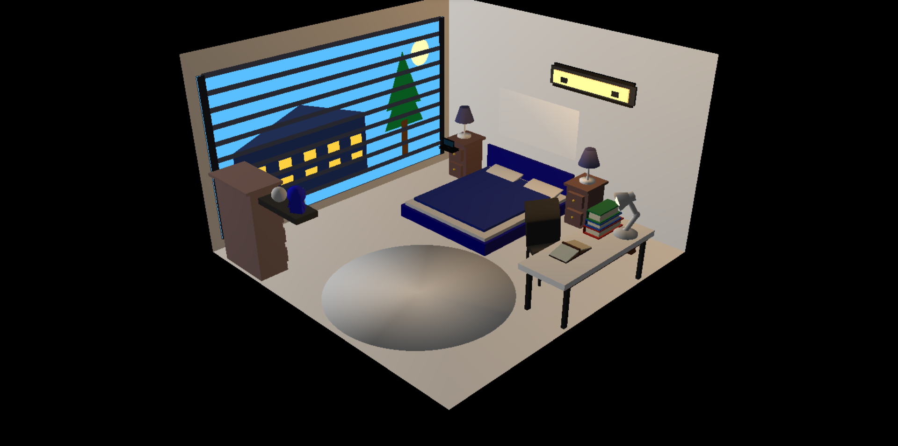

# Bedroom OpenGL Project

A 3D bedroom environment developed using **C++ and OpenGL/FreeGLUT**.

This project demonstrates 3D modeling, object transformations, lighting, materials, camera positioning, and texture-based rendering in an OpenGL environment.

## Project Preview



## Features

- 3D bedroom environment
- Bed with pillows and blanket
- Large window with night scenery
- Television and TV stand
- Study table with books and an open book
- Table lamps
- Horizontal wall light with illumination
- Wardrobe
- Carpet
- Decorative objects
- Multiple lighting effects
- Material properties
- 3D transformations
- Camera/view transformation
- OpenGL rendering

## Technologies Used

- C++
- OpenGL
- FreeGLUT
- Code::Blocks
- Visual Studio Code
- Git & GitHub

## Project Structure

```text
final project/
│
├── bin/
├── obj/
├── screenshots/
│   └── bedroom.png
│
├── final project.cbp
├── final project.depend
├── final project.layout
├── main.cpp
└── README.md
